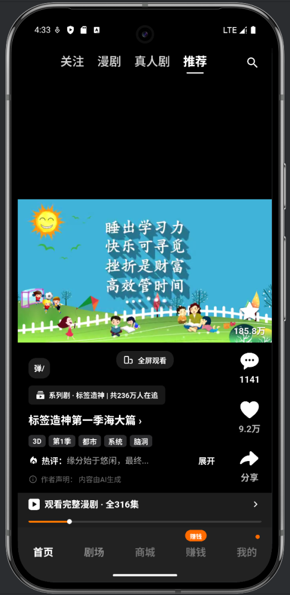

# hg_app

短剧（短视频）App 的 Flutter 客户端，面向 iOS 与 Android，核心体验是沉浸式上下滑刷剧播放。



## 项目阶段：初级阶段

本项目目前处于**初级阶段（MVP 验证期）**，主要目标是跑通「首页短剧信息流 + 播放器交互」这条主链路，验证体验与架构方向，尚未进入完整业务开发阶段。现阶段的典型特征：

- 页面数据来自本地 Mock（`lib/features/player/data/player_feed_repository.dart`），视频使用工程内本地资源，后端接口尚未联调。
- 网络层（Dio）与本地存储（Hive）只做了最小占位初始化，还没有实际读写逻辑。
- 底部导航中除首页外，其余标签页目前是空页面占位。
- 登录、搜索、剧场分类、个人中心、分享、埋点、推送等能力均未实现。

因此 README 中的「功能方向」是规划目标，不代表当前已全部可用；「当前开发状态」才是代码里真实存在的部分。

## 当前开发状态

已完成：

- **底部导航 Shell**：`lib/core/navigation/`，5 个标签（首页 / 剧场 / 商城 / 赚钱 / 我的）通过 `IndexedStack` 常驻切换，切换只改索引、不做路由跳转，首页播放器不会被销毁。
- **首页短剧信息流与播放器**：`lib/features/player/`
  - 上下滑切换剧集，切换时提前准备相邻剧集的播放资源；
  - 顶部频道栏（关注 / 推荐 / 漫剧 / 真人剧）；
  - 点赞、收藏、追剧的即时反馈与计数更新；
  - 播放 / 暂停点击层、进度条、横竖屏切换、评论与弹幕入口、系列剧与观看完整剧集入口；
  - 离开首页标签时暂停播放并保留播放器实例，切回后恢复，且不覆盖用户手动暂停状态。
- **暗色主题**：`lib/core/theme/app_theme.dart`，统一黑底 + 橙色主色的视觉基调。
- **基础测试**：`test/widget_test.dart`（播放器布局与交互、标签切换、播放暂停）、`test/player_feed_repository_test.dart`。

未完成（规划中）：

- 后端接口对接（剧集列表、详情、选集、播放鉴权）；
- 登录与游客身份（Apple / Google / 邮箱密码）；
- 剧场分类、榜单、筛选，搜索与热门关键词；
- 个人中心、设置、多语言、账号注销；
- 复制链接 / 系统分享 / SMS / WhatsApp 等分享能力；
- HLS 多码率播放与真实播放鉴权；
- 埋点、推送、崩溃监控接入。

## 主要功能方向

| 方向 | 目标 |
|---|---|
| 播放体验 | 上下滑切换减少黑屏与等待，弱网有加载态与重试，播放器实例数量受控 |
| 剧场与内容分发 | 分类、榜单、筛选、详情页与选集，支持继续观看 |
| 搜索 | 关键词搜索与热门词推荐 |
| 账号体系 | 游客模式 + 第三方/邮箱登录，Token 刷新 |
| 分享与增长 | 后端生成带短剧 ID、剧集 ID、渠道与归因参数的分享链接 |
| 稳定性与数据 | 埋点事件、崩溃监控、观看进度本地记录并定时同步 |

体验上的硬性要求：播放流畅、滑动顺滑、首屏加载快、弱网稳定；互动操作先即时反馈再异步提交；列表封面与海报走缓存避免重复请求。

## 技术选型背景

选型出发点是「一套代码覆盖 iOS / Android，同时不牺牲播放与滑动体验」，且便于后续与 Node.js 后端对接。

| 类型 | 方案 | 选择原因 |
|---|---|---|
| 跨端框架 | Flutter + Dart | 双端一致的高性能渲染，自绘保证滑动与动画帧率 |
| 状态管理 | Riverpod | 编译期安全、无 context 依赖，便于拆分播放器与业务状态 |
| 路由 | go_router | 声明式路由，便于后续深链与分享落地页扩展 |
| 网络请求 | Dio | 拦截器体系适合统一鉴权、重试与日志 |
| 本地缓存 | Hive | 轻量 KV，适合观看进度与列表缓存 |
| 敏感数据存储 | flutter_secure_storage | Token 等凭据走系统安全存储 |
| 视频格式 | HLS 多码率 | 结合 CDN 做码率自适应，兼顾清晰度与起播速度 |
| Android 播放器 | Media3 / ExoPlayer | 官方方案，HLS 与缓存策略成熟 |
| iOS 播放器 | AVPlayer | 系统级 HLS 支持，功耗与稳定性最好 |
| 推送 | Firebase Cloud Messaging | 海外统一推送通道 |
| 崩溃监控 | Firebase Crashlytics | 与 Firebase 生态打通 |
| 埋点 | Firebase Analytics + 自建业务埋点 | 通用漏斗分析 + 业务自定义事件 |

当前 MVP 阶段播放直接使用 `video_player` 插件（其底层即 ExoPlayer / AVPlayer），后续再按上表切换到原生播放器能力与 HLS 多码率方案。

后端侧约定为 Node.js + NestJS、PostgreSQL、Redis、AWS S3 + CloudFront；App 通过 REST API 对接，播放地址由播放鉴权接口下发，客户端不写死长期有效的视频地址。

## 目录结构

```text
lib/
  core/              网络、路由、导航 Shell、缓存、主题、通用组件
  features/
    home/             首页入口（承载播放器信息流）
    player/           短剧播放、手势、弹幕、进度
    theater/          剧场、分类、榜单、筛选（占位）
    mall/             商城（占位）
    earn/             赚钱（占位）
    profile/          个人中心、设置（占位）
```

页面层只负责展示与交互，接口请求、业务逻辑与播放器状态放在 `data/`、`application/`、`domain/` 中，不堆在 Widget 内。

## 本地开发


```powershell
& "flutter.bat" pub get
& "flutter.bat" analyze
& "flutter.bat" test
& "flutter.bat" run
& "flutter.bat" build apk --release
```

提交前至少执行 `analyze`；涉及业务逻辑、状态管理、数据解析的改动需要补充或更新测试。

## 当前版本不做

- 不接入广告 SDK，不实现广告展示、激励/插屏广告与广告收益统计。
- 不在客户端硬编码生产环境密钥、长期 Token 与私有地址。
- 不在业务代码中使用 `print` 输出调试信息，也不把 Token、邮箱、用户 ID 等敏感信息写入日志。
